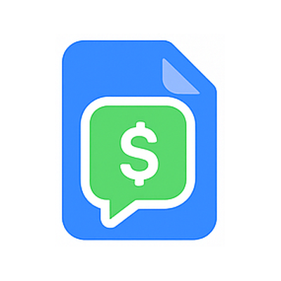

<p align="center"></p>

# QuoteBill MCP server

Draft quotations and invoices from the AI assistant you already use. QuoteBill's remote MCP server gives ChatGPT, Claude, Gemini and any other MCP client:

- **133 quotation and invoice templates** for trades, professional services, countries and languages
- **Tax rules for 195 countries**, each with the official source it was read from and the date it was checked
- **Totals** worked out with the same arithmetic as the QuoteBill editor, rounded to the currency
- **A link to the finished document**: `build_document` returns a URL that opens the drafted quotation or invoice, filled in, on [quotebill.com](https://quotebill.com), ready to download as Excel or Word or to save as a PDF

| | |
|---|---|
| Endpoint | `https://quotebill.com/mcp` |
| Transport | Streamable HTTP (JSON responses) |
| Authentication | None. Every tool is read-only and nothing is stored |
| Protocol | 2026-07-28, and the handshake revisions 2025-03-26 to 2025-11-25 |
| Languages | Answers in 33 languages |
| Guide for people | [Use QuoteBill in ChatGPT, Claude and Gemini](https://quotebill.com/en/guides/connect-ai-assistants/) |
| MCP Registry | `io.github.auto1225/quotebill` |

## Connect

**Claude** (claude.ai, desktop and mobile) — Settings → Connectors → Add custom connector. Name `QuoteBill`, URL `https://quotebill.com/mcp`. Or open this link: [add QuoteBill to Claude](https://claude.ai/customize/connectors?modal=add-custom-connector&connectorName=QuoteBill&connectorUrl=https%3A%2F%2Fquotebill.com%2Fmcp).

**ChatGPT** (chatgpt.com) — turn on developer mode in Settings, then create an app from the apps page: MCP server URL `https://quotebill.com/mcp`, authentication *No authentication*. Add QuoteBill from the **+** menu in a chat.

**Claude Code**

```sh
claude mcp add --transport http quotebill https://quotebill.com/mcp
```

**Codex** — `~/.codex/config.toml`

```toml
[mcp_servers.quotebill]
url = "https://quotebill.com/mcp"
```

**Gemini CLI** — install this repository as an extension:

```sh
gemini extensions install https://github.com/auto1225/quotebill-mcp
```

or add it to `~/.gemini/settings.json`:

```json
{ "mcpServers": { "quotebill": { "httpUrl": "https://quotebill.com/mcp" } } }
```

**Cursor** — `.cursor/mcp.json`

```json
{ "mcpServers": { "quotebill": { "url": "https://quotebill.com/mcp" } } }
```

**VS Code** — `.vscode/mcp.json`

```json
{ "servers": { "quotebill": { "type": "http", "url": "https://quotebill.com/mcp" } } }
```

**Claude Code plugin** — this repository is also a plugin marketplace:

```sh
/plugin marketplace add auto1225/quotebill-mcp
/plugin install quotebill@quotebill
```

## Tools

| Tool | What it does |
|---|---|
| `search_templates` | Finds templates by words, document type or category, in the language asked for, with example line items and the page each opens on. |
| `get_template` | The full record for one template slug. |
| `get_tax_rule` | The published rate, its name, the currency and the source it was read from, for any of 195 countries. Countries with no single national rate, such as the United States, are reported as needing a jurisdiction instead of being given a made-up number. |
| `calculate_totals` | Adds up line items, applies discounts and the country's tax, rounding each tax component separately to the currency. |
| `build_document` | Builds a complete quotation or invoice, totals it and returns a link that opens it filled in. `language` is the document's language; `interfaceLanguage` the language the page opens in. |
| `list_guides` | QuoteBill's how-to guides, such as converting a quote to an invoice or what a German, Japanese or Korean invoice must contain. |
| `list_reference` | The categories, layouts, languages and country codes the other tools accept. |

Every tool publishes an `inputSchema` and an `outputSchema`, and is annotated `readOnlyHint: true`, `destructiveHint: false`, `idempotentHint: true`, `openWorldHint: false`. Invalid arguments come back as a tool error that says what to correct.

## Example requests

- "Make an invoice in QuoteBill for my client in Japan: website design ¥480,000, plus three months of maintenance at ¥25,000 a month, with 5% off the maintenance."
- "Use QuoteBill to make a quotation for 12 hours of consulting at €95 an hour for a client in Germany."
- "Find a QuoteBill template for a plumbing quotation and fill it in with these jobs."
- "What is the VAT rate in France, and where does QuoteBill get it from?"

## Privacy

The server only looks up templates and tax rules and does arithmetic. It saves nothing and keeps no client names or amounts; its log records the tool, whether it answered and the client's name, never the arguments. A drafted document travels inside the returned link, after the `#`, which browsers never send to a server, and the link carries a checksum so an altered copy is refused rather than opened with a wrong figure. Calls are rate-limited per network address using a salted hash that changes every minute; those counts are deleted within an hour. See the [privacy notice](https://quotebill.com/en/privacy/).

## Limits

- 60 tool calls per minute per network address
- Up to 200 line items and amounts up to 100,000,000,000 per line and per document
- A published tax rate is a starting point, not tax advice: registration, place of supply and the treatment of the goods or services still have to be confirmed

## Support

[auto0104@gmail.com](mailto:auto0104@gmail.com) · [quotebill.com/en/contact](https://quotebill.com/en/contact/)

## License

The configuration files in this repository are MIT licensed. The QuoteBill service is operated at [quotebill.com](https://quotebill.com).
